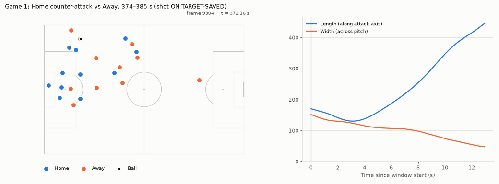
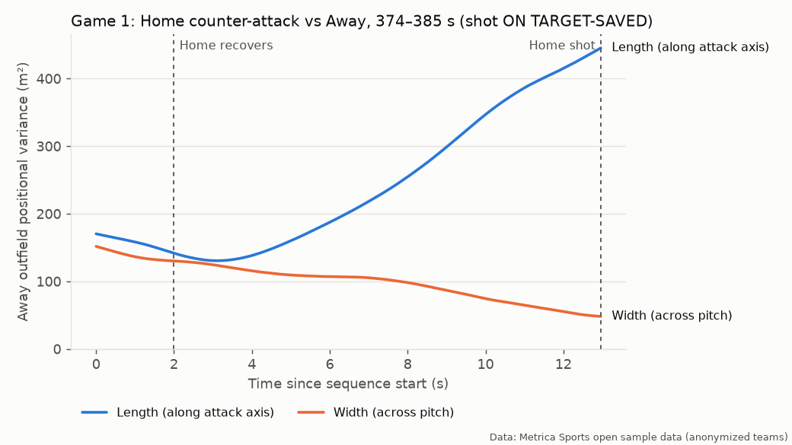
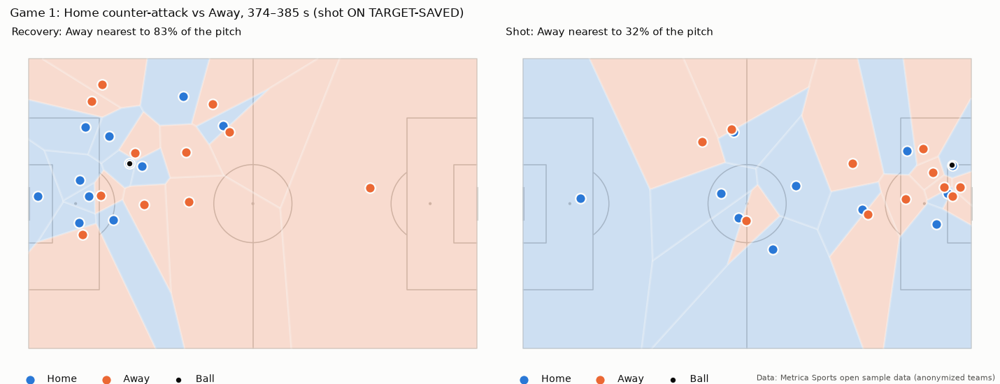
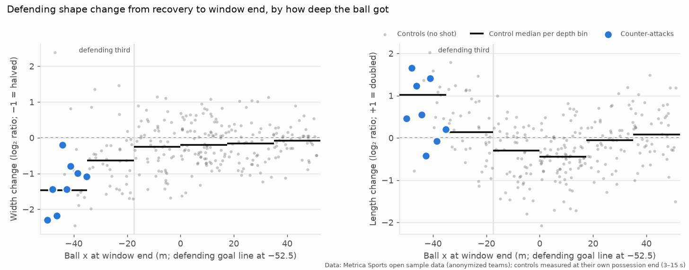
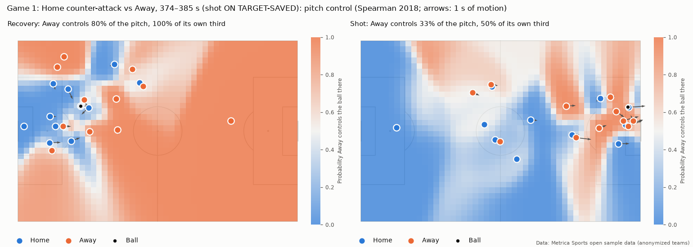
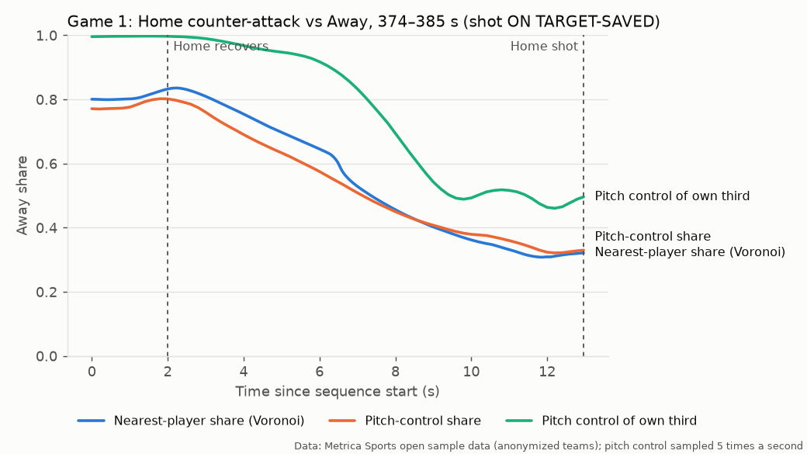
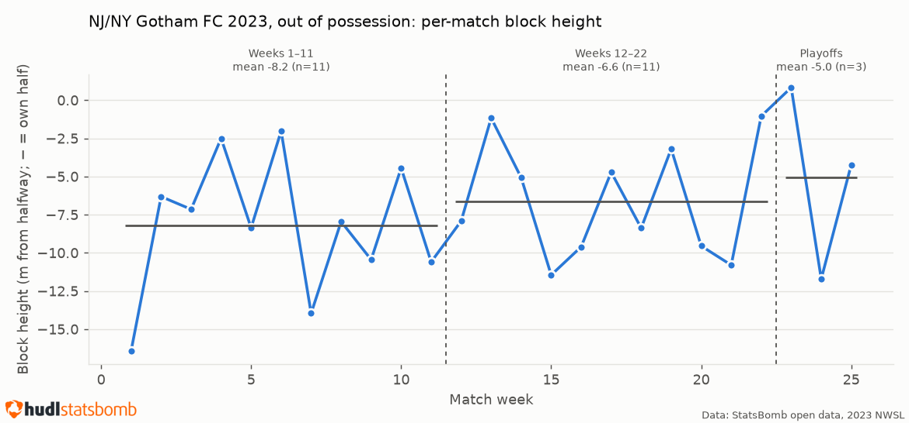

# The Entropy of Transition

**Treating a soccer defense as a system of interacting particles, and testing whether its organization breaks down during counter-attacks. Mostly it doesn't, and the reason why is the interesting part.**

It applies a biophysics lens (positional entropy, the gyration tensor, Voronoi territory, Spearman pitch control) to defensive structure, rather than building another generic xG model.



*Game 1, a Home counter-attack (Metrica open tracking data). The defending team (orange) narrows while stretching front to back.*

## In short

- **Hypothesis.** A compact defense is a low-entropy system, and a fast counter-attack should make it *decohere*: spacing becomes uneven and gaps open.
- **What the tracking data shows.** In all 8 rule-detected counter-attacks the defense does not scatter. It **changes shape**, from wide-and-short to narrow-and-long. Width falls in 8 of 8, length rises in 6 of 8, and grid entropy falls or stays flat in 7 of 8.
- **Baseline.** The counters were compared with 287 own-half recoveries that produced no shot, measured at the same time after each recovery. Against that full set the counters stand out (p ≈ 0.0002 for width). Against controls whose ball got just as deep, they are **not clearly different**: the shape change mostly tracks where the ball is, not whether the play is a counter-attack. Under 8 variants of the detection rule, the shape change holds up (width falls in 15 of the 16 counters found by the loosest rule). A smaller counter-specific narrowing is possible but not established. A Spearman pitch-control model tells the same story: the defense's control of its own third falls from ~98% to ~52%, but about as much as in any possession that gets the ball that deep.
- **Season scale (event data).** Gotham FC's average shape across its 2023 title season shows **no robust change** (0 of 18 tests pass a multiple-comparison correction).
- **The point.** Each claim comes with a stated rule, a baseline or significance test, and one command that reproduces it. The original hypothesis was not supported and the season comparison is a null result; both are reported as such.

## The hypothesis

A compact, organized defense is a low-entropy system: players occupy predictable, mutually-spaced positions that jointly cover the dangerous areas of the pitch. A fast counter-attack forces rapid decisions under time pressure, so the defensive shape might decohere: gaps open, spacing becomes uneven, coverage overlaps in some areas while conceding space in others. This project set out to measure that decay, using two complementary approaches depending on data type (see **Data sources and honest limitations** below). **Findings** reports what the measurements showed, including where they contradict this framing.

## Data sources and honest limitations

This project intentionally does **not** claim access to any club's proprietary tracking or GPS data. That data belongs to the clubs and their vendors (e.g., SkillCorner, Second Spectrum) and is not public. Two public datasets are used instead, for two different (and non-interchangeable) purposes:

| Data source | What it actually contains | What it's used for here |
|---|---|---|
| **Metrica Sports open sample data** ([metrica-sports/sample-data](https://github.com/metrica-sports/sample-data)) | Real 25fps x/y tracking for all 22 players + ball, for 3 full anonymized matches, synced with event data | **The real physics**: frame-by-frame positional entropy and Voronoi territory control during actual counter-attack sequences. This is the only data here with simultaneous multi-player positions, so it's the only data where an instantaneous, all-player shape measure is literally computable. |
| **StatsBomb open data, 2023 NWSL season** ([statsbomb/open-data](https://github.com/statsbomb/open-data), competition ID 49, season ID 107) | Full event data (passes, carries, shots, pressures, xG) for every 2023 NWSL match, including Gotham FC's title-winning season. Each event records **the position of the player on the ball**. Shot events also carry a **freeze frame**: the positions of the players in camera view at the instant of the shot. There is no continuous position data for all 22 players between events | **The aggregate proxy**: rolling-window average positions per player, used to approximate team shape/compactness over the course of a real season, on a real team, without claiming frame-by-frame entropy this data can't actually support |

**Two things this project deliberately does not do, and why:**
- **No seasons or teams beyond the free release.** StatsBomb's free NWSL data covers 2023 (and 2018, unused here). Later seasons and teams that did not exist in 2023 are not added without a real, current data source; `tests/test_loaders.py` checks that every match is from 2023.
- **No claim of frame-by-frame entropy from StatsBomb event data alone.** StatsBomb's free NWSL release has no "360" files (which would give player positions at every event). It does include per-shot freeze frames, but those are single snapshots at the moment of a shot, limited to players in camera view and without velocities, so they cannot follow a defense through a counter-attack. For season-scale shape, only aggregate/rolling-window position proxies are honest to compute from this dataset; see `src/features/formation.py`.

## Repo structure

```
entropy-of-transition/
├── src/
│   ├── data/           # loaders, cleaning, rule-based counter-attack detection (sequences.py)
│   ├── features/       # entropy/dispersion, Voronoi territory, pitch control, formation aggregates, baseline
│   ├── viz/            # mplsoccer plotting + animation helpers
│   ├── pipeline.py     # end-to-end orchestration: raw data -> data/processed/*.csv
│   ├── sensitivity.py  # robustness of the findings to the counter-attack thresholds
│   └── figures.py      # data/processed/ -> reports/figures/ (PNGs + GIFs)
├── app/
│   └── streamlit_app.py # interactive demo, reads data/processed/ only
├── reports/figures/     # rendered figures (regenerate with python -m src.figures)
├── reports/assets/      # StatsBomb logo (from their media pack, for attribution)
├── tests/
├── scripts/
│   └── download_data.sh # fetches both datasets into data/external
└── data/                # gitignored except .gitkeep; populated by scripts/download_data.sh
```

## Setup

```bash
python -m venv .venv && source .venv/bin/activate
pip install -r requirements.txt
bash scripts/download_data.sh          # Metrica (235 MB) + StatsBomb 2023 NWSL only (~390 MB)

python -m src.pipeline                 # ~2 min: writes the analysis tables to data/processed/
python -m src.sensitivity              # ~4 min: re-runs detection + baseline for 8 rule variants
python -m src.figures                  # ~2 min: writes PNGs + GIFs to reports/figures/
streamlit run app/streamlit_app.py     # interactive demo

pytest -m "not integration"            # unit tests (synthetic, hand-checkable cases)
pytest -m integration                  # also checks the real data, pipeline outputs and app
```

Every number in **Findings** below is produced by these commands; nothing is
hand-entered or picked after the fact.

## Findings

### 1. Counter-attacks (Metrica tracking data, 3 anonymized matches)

`src/data/sequences.py` defines a counter-attack operationally: a ball
recovery in the recovering team's own half, then its shot 3–15 s later, with
no stoppage, opponent recovery or own ball loss in between. That finds **8
sequences** across the 3 matches. For each one, the defending team's
outfield shape (goalkeeper excluded) at the recovery and at the shot:

| Game | Counter by | Recovery x (m) | Duration (s) | Shot | Length var. (m²) | Width var. (m²) | Grid entropy (nats) | Defending Voronoi share |
|---|---|---|---|---|---|---|---|---|
| 1 | Home | -37.8 | 11.8 | off target-out | 278 → 319 | 87 → 41 | 2.30 → 1.75 | 73% → 22% |
| 1 | Home | -29.4 | 11.0 | on target-saved | 141 → 445 | 130 → 48 | 2.30 → 2.03 | 83% → 32% |
| 1 | Away | -19.9 | 14.2 | on target-saved | 112 → 106 | 108 → 54 | 2.30 → 2.16 | 53% → 25% |
| 1 | Home | -12.6 | 11.5 | head-on target-saved | 175 → 241 | 332 → 67 | 2.16 → 1.97 | 54% → 30% |
| 2 | Home | -12.6 | 8.7 | on target-saved | 201 → 536 | 121 → 70 | 2.30 → 2.30 | 85% → 39% |
| 2 | Away | -1.1 | 14.2 | on target-goal | 113 → 165 | 93 → 81 | 2.03 → 2.30 | 39% → 22% |
| 2 | Away | -21.0 | 10.3 | on target-saved | 105 → 246 | 214 → 47 | 2.03 → 1.83 | 73% → 24% |
| 3 | Home | -48.6 | 14.7 | on target-saved | 322 → 240 | 300 → 111 | 2.30 → 2.30 | 72% → 28% |

*Length/width variance: positional variance of the defending outfield
players along/across the direction of attack (their sum is the squared
radius of gyration). Recovery x is in the attacking team's frame (negative =
own half). Source: `data/processed/metrica_counter_attacks.csv` and
`metrica_sequence_timeseries.csv`.*

**What the data shows:**

- **The defense narrows in all 8 sequences**: width variance falls, often
  by 2–5× (e.g. 332 → 67 m²). The baseline in 1b shows most of this is what
  defenses do whenever the ball reaches their third, counter-attack or not.
- **It stretches front-to-back in 6 of 8** (e.g. 141 → 445 m², 201 → 536 m²).
  Recovering defenders sprint back while others are still upfield.
- **Grid entropy falls or stays flat in 7 of 8.** By this measure the shape
  becomes *more concentrated*, not more disordered, as players funnel toward
  the ball and the goal. The "defense decoheres, entropy rises" framing in
  *The hypothesis* above is **not supported** by these sequences. A better
  description is a change of shape: from wide-and-short to narrow-and-long.
- A single scalar hides this. The RMS spread rises in some sequences and
  falls in others because the two axes move in opposite directions. Splitting
  the gyration tensor's diagonal into along- and across-axis parts is what
  makes the pattern visible.
- **The defending team's Voronoi share falls in all 8** (e.g. 85% → 39%).
  This is real but largely mechanical: a team pushed back toward its own
  goal is nearest to less of the pitch by construction. It shows *where* the
  play went, not that the defense became disorganized.
- **Exceptions matter.** Game 3's counter (recovery inside the box, the
  longest at 14.7 s) does stretch (length peaks at ≈355 m² about 1.5 s after
  the recovery), but then *shortens* again as the defense recovers its shape
  before the shot.

**Limits:** 8 sequences from 3 anonymized matches (with no teams, players or
competition named) are enough to show a consistent pattern and a method,
not to establish an effect. The counter-attack thresholds are choices, not
standards (see `config.yaml`). Grid entropy saturates at ln 10 ≈ 2.30 nats
for 10 players on the default grid, so it mostly counts occupied cells.

Headline sequences (curated with stated reasons in `config.yaml`, rendered
by `python -m src.figures`). The typical pattern, game 1:





Also rendered: the only counter that ends in a goal (game 2,
`reports/figures/game2_seq2_*`) and the counter-example (game 3,
`reports/figures/game3_seq1_*`), each as a shape plot, a Voronoi plot, a
pitch-control plot (1d) and a GIF.

### 1b. Baseline: is this specific to counter-attacks?

The patterns above could just be what any defense does after losing the
ball upfield. To test that, `find_control_recoveries` collects **287
control windows**: own-half recoveries under the same rules whose possession
ended *without* a shot (174 ended in a turnover or stoppage, 113 reached the
15 s cap). Each counter-attack of duration *d* is compared with every control
that lasted at least *d*, measured *d* seconds after its own recovery. Each
counter gets a percentile among its controls. A permutation test
(`src/features/baseline.py`) asks whether those percentiles average 0.5, as
they would if counters behaved like controls. The comparison uses three
control sets, each stricter about where the ball is:

- **All**: every duration-matched control (116–176 per counter).
- **Defending third**: only controls whose ball, at the matched time, is at
  x ≤ −17.5 m in the defending team's frame (13–22 per counter, 38 distinct).
- **Depth-matched**: only controls whose ball is within ±10 m of where the
  counter's ball was at the shot (2–9 per counter, 16 distinct).

Mean percentile of the counters among their controls (0.5 = typical), with
the permutation p-value. Bonferroni threshold: 0.05 / 18 tests ≈ 0.0028
(six metrics × three control sets; the two pitch-control rows are explained
in 1d).

| Change from recovery to shot | Counters (median) | All controls | Defending third | Depth-matched |
|---|---|---|---|---|
| Width variance | ×0.42 | 0.14 (p = 0.0002) ✓ | 0.30 (p = 0.067) | 0.33 (p = 0.20) |
| Length variance | ×1.42 | 0.83 (p = 0.0008) ✓ | 0.63 (p = 0.24) | 0.53 (p = 0.82) |
| Grid entropy | −0.17 nats | 0.29 (p = 0.026) | 0.44 (p = 0.56) | 0.35 (p = 0.25) |
| Defending Voronoi share | −45 points | 0.14 (p = 0.0002) ✓ | 0.29 (p = 0.054) | 0.29 (p = 0.12) |
| Defending pitch-control share | −41 points | 0.14 (p = 0.0001) ✓ | 0.28 (p = 0.044) | 0.27 (p = 0.083) |
| Pitch control of own third | −46 points | 0.05 (p = 0.00005) ✓ | 0.24 (p = 0.013) | 0.36 (p = 0.29) |

**Against all controls, counter-attacks stand out.** At the same elapsed
time, control defenses narrow only slightly (median ×0.81–0.86) and get
*shorter* (×0.76–0.85).

**Once the ball's position is accounted for, the difference mostly
disappears.** Controls whose ball reached the defending third narrow too,
and mostly lengthen. With the ball matched to within 10 m of the counter's,
the length difference is gone (mean percentile 0.53). The figure below shows
why: shape change follows ball depth, for counters and controls alike.
The 11 controls whose possession ended with the ball deeper than −35 m
narrowed by a median ×0.36 and lengthened ×2.0. The counters, whose balls ended at a median
−43 m, narrowed ×0.42 and lengthened ×1.42. So the wide-to-narrow-and-long
change is **largely what a defense does when the ball arrives near its goal,
not a signature of counter-attacks as such.**



*Controls are measured at their own possession end (3–15 s), so the plot is
descriptive; the matched tests above control for elapsed time. 13 controls
with an untracked ball are omitted.*

**What this cannot rule out:** a smaller narrowing specific to counters. The
width percentile is below 0.5 in every control set (0.30, 0.33). The
depth-matched set is small (16 distinct controls), so it has little power.
The same controls are reused across counters, so the counters' percentiles
are not independent, which makes all these p-values somewhat optimistic.
Section 1c shows what happens with more counters.

Per-counter views: `reports/figures/baseline_all.png`,
`baseline_ball_in_defending_third.png`, `baseline_ball_depth_matched.png`.
Tables: `data/processed/metrica_baseline_tests.csv`,
`metrica_baseline_percentiles.csv`, `metrica_window_end_changes.csv`.

### 1c. Robustness to the counter-attack rule

The rule's three thresholds are choices, so `python -m src.sensitivity`
re-runs detection and the full baseline for 8 variants (`config.yaml`,
`features.sensitivity`). The default variant reproduces the tables above
exactly; `tests/test_sensitivity.py` checks that.

| Variant | Counters | Width fell | Length rose | Entropy fell or flat | Width vs. defending third (p) | Width vs. depth-matched (p) | Length vs. depth-matched (p) | Own-third control vs. defending third (p) |
|---|---|---|---|---|---|---|---|---|
| Default (3–15 s, own half) | 8 | 8 | 6 | 7 | 0.067 | 0.20 | 0.82 | 0.013 |
| Min 2 s | 8 | 8 | 6 | 7 | 0.067 | 0.20 | 0.82 | 0.013 |
| Min 5 s | 8 | 8 | 6 | 7 | 0.067 | 0.20 | 0.82 | 0.013 |
| Max 10 s | 1 | 1 | 1 | 1 | – | – | – | – |
| Max 20 s | 12 | 11 | 10 | 11 | 0.0084 | 0.017 | 0.36 | **0.0013** ✓ |
| Recovery in own third | 5 | 5 | 3 | 5 | 0.0090 | 0.12 | 0.87 | 0.0070 |
| Recovery up to 10 m into the opponent's half | 11 | 11 | 8 | 9 | 0.096 | 0.31 | 0.47 | 0.052 |
| Loosest (2–20 s, up to +10 m) | 16 | 15 | 13 | 14 | **0.0025** ✓ | 0.0065 | 0.073 | **0.0010** ✓ |

*✓ = passes that variant's Bonferroni threshold (0.05 / 18 ≈ 0.0028). Max 10 s
leaves a single counter, so its tests are not meaningful. Full tables:
`data/processed/metrica_sensitivity_counts.csv`, `metrica_sensitivity_tests.csv`.*

- **The shape change itself is robust.** The loosest variant's 16 counters
  include every counter found by any variant. Width falls in 15 of them,
  length rises in 13, and grid entropy falls or stays flat in 14. The
  defending team's control of its own third (1d) falls in all 16. The
  variants overlap, so they are not independent replications.
- **The minimum duration doesn't matter.** No variant finds a counter
  shorter than 8.7 s, and only controls at least that long are ever compared
  with one. Most counters take 10–15 s, so a 10 s cap leaves just one.
- **Against all controls, counters stand out in every variant** with 5 or
  more counters (width p ≤ 0.0002).
- **Against near-goal controls, the answer depends on sample size.** With the
  16 counters of the loosest rule, counters are narrower and longer than
  defending-third controls (width p = 0.0025, length p = 0.0008, both
  passing). They also keep less control of their own third (p = 0.0010; with
  a 20 s cap, p = 0.0013). Against depth-matched controls, no variant passes
  on any metric. The closest is width under the loosest rule (p = 0.0065).
  This is consistent with a real but smaller counter-specific effect on top
  of the ball-depth effect. It comes from 144 exploratory tests across 8
  overlapping variants, though, so it is a lead for more data, not a
  finding.

### 1d. Pitch control: does the defense lose the space near its goal?

The Voronoi share gives every point to the nearest player. It ignores
which way players are running and how long the ball takes to get there.
`src/features/pitch_control.py` implements Spearman's (2018) pitch-control
model, which accounts for both. Each player is given an arrival time at
every point (current velocity for 0.7 s, then a 5 m/s run), with
uncertainty. From those arrival times and the ball's travel time it
computes the probability that each team wins a ball played to each point
of a 50 × 32 grid. The parameters are Laurie Shaw's published defaults
for this same Metrica data. The vectorized implementation agrees with his
reference code to ~1e-15 on real frames. Two summaries enter the baseline:
the defending team's share of the whole pitch, and its control of its own
defensive third (x ≤ −17.5 m in its frame).

- **Whole-pitch control adds little to Voronoi.** At the recovery and at
  the shot, the two shares are within 4 points of each other in all 8
  counters (e.g. 83% → 32% Voronoi vs. 80% → 33% pitch control).
- **Control of the defending third collapses.** At the recovery the
  defending team controls 78–100% of its own third (median 98%). At the
  shot it controls 27–66% (median 52%). It falls in all 8 counters.
- **But this, too, follows the ball.** Against all controls the counters
  are extreme (mean percentile 0.05). Against controls whose ball reached
  the defending third, they sit at 0.24 (p = 0.013). That is the lowest
  percentile of the six metrics in that set, but it doesn't pass the 0.0028
  threshold. Against depth-matched controls they sit at 0.36 (p = 0.29).
  The 11 controls whose ball ended deeper than −35 m lost a median 44
  points of own-third control. The counters lost 46.

So the more realistic territory model confirms the conclusion of 1b
rather than changing it. The defense does lose the space near its goal,
but about as much as it does whenever the ball gets there.





*Limits:* the model parameters are Shaw's defaults, not fitted to these
matches. Offside is applied at the frame itself (second-last defender,
ball or halfway line). The ball's start point is its tracked position, so
the surface answers "who would win a ball played anywhere *now*". Headline
series sample pitch control 5 times a second. The baseline reads it at
exactly the frames it compares.

### 2. Gotham FC's 2023 season (StatsBomb event data, aggregate proxy)

Gotham went from last place in 2022 to the 2023 title. The question was
whether that shows up as a change in team shape across the season. Event
data records only the player on the ball (freeze frames exist only at
shots), so "shape" here is the average
event position of Gotham's 10 most-involved outfielders. It is computed
separately with and without the ball, and compared between match weeks
1–11, weeks 12–22, and the 3 playoff matches.

**Result: no robust change.** Each of 18 comparisons uses Welch's t-test on
per-match values: 2 phases × 3 metrics (block height, length, width) × 3
window pairs. **None** passes a Bonferroni-corrected threshold
(0.05 / 18 ≈ 0.0028). The smallest p-values:

- Out of possession, length: playoffs shorter than weeks 12–22
  (31.8 vs 42.9 m, p = 0.008), but n = 3 playoff matches.
- Out of possession, length: weeks 12–22 longer than weeks 1–11
  (42.9 vs 36.7 m, p = 0.018).
- In possession, width: weeks 12–22 narrower than weeks 1–11
  (43.5 vs 48.0 m, p = 0.017).
- Out of possession, block height rises across the windows
  (−8.2 → −6.6 → −5.0 m from halfway), but p ≥ 0.38. Single matches range
  from about −16 to +1 m (figure below).

This is a null result, reported as one. Event-position averages may simply
be too coarse to detect a shape change that tracking data would show.
Single-match values also vary much more than the differences between
windows. Full table: `data/processed/statsbomb_window_tests.csv`.



**A methodological trap, documented in `src/features/formation.py`:** a
player's position averaged over many matches is pulled toward their long-run
mean. Pooled multi-match windows therefore report a much smaller shape than
the average single match (out of possession: pooled length ≈ 30 m vs.
37–43 m per match). Compare pooled with pooled and per-match with per-match.

## Data credits

- **Metrica Sports** sample data: https://github.com/metrica-sports/sample-data
  (Metrica asks that public use acknowledges the source).
- **StatsBomb** open data: https://github.com/statsbomb/open-data. StatsBomb's
  terms ask that published work states StatsBomb as the data source **and uses
  their logo** (https://statsbomb.com/media-pack/). The StatsBomb-based
  figures and app tab carry both.

  
- Both datasets stay under their providers' own terms. No data is
  redistributed here: `scripts/download_data.sh` fetches it from the original
  sources.
- **Pitch control**: W. Spearman, "Beyond Expected Goals", MIT Sloan Sports
  Analytics Conference 2018
  (https://www.sloansportsconference.com/research-papers/beyond-expected-goals).
  Parameters, shortcuts and integration scheme follow Laurie Shaw's
  Friends of Tracking implementation for the Metrica data
  (https://github.com/Friends-of-Tracking-Data-FoTD/LaurieOnTracking,
  `Metrica_PitchControl.py`); `src/features/pitch_control.py` is an
  independent vectorized re-implementation, checked to agree with it to
  ~1e-15 on real frames.
- Tools: [kloppy](https://github.com/PySport/kloppy) (Metrica EPTS reading),
  [mplsoccer](https://github.com/andrewRowlinson/mplsoccer) (pitch drawing),
  scipy (Voronoi, Welch's t-test).

## Roadmap

- [x] `src/data/metrica_loader.py`: load tracking + event data for all 3 Metrica sample games *(game 3 tracking via kloppy; its events parsed from JSON into the same schema)*
- [x] `src/data/statsbomb_loader.py`: load full 2023 NWSL event data *(from a local sparse clone of statsbomb/open-data, not `statsbombpy` at runtime)*
- [x] `src/features/entropy.py`: frame-level positional entropy and dispersion time series (Metrica data)
- [x] `src/features/voronoi.py`: Voronoi territory control per frame (Metrica data) *(pure nearest-player territory)*
- [x] `src/features/pitch_control.py`: Spearman (2018) pitch control, vectorized over the pitch grid (Findings 1d)
- [x] `src/features/formation.py`: window/per-match average-position compactness (StatsBomb data)
- [x] `src/pipeline.py`: orchestrate: load → clean → compute features → save results *(`python -m src.pipeline` writes 15 CSVs to `data/processed/`; ~2 min. Control windows are computed only at the frames the baseline reads, which gives the same values as full series)*
- [x] `src/viz/pitch_plots.py` + `animations.py`: static and animated pitch visualizations *(GIF via Pillow; MP4 needs ffmpeg)*
- [x] `app/streamlit_app.py`: interactive demo *(tested with Streamlit's AppTest)*
- [x] Identify 2-3 real counter-attack sequences in the Metrica data to use as headline examples *(3 of 8 detected, curated with stated criteria in `config.yaml`)*
- [x] Identify a real "structural evolution" case study in the 2023 NWSL data (e.g., Gotham FC's shape earlier vs. later in their title run) *(done: the result is null, see Findings)*
- [x] Write up findings in a final report section of the README
- [x] Baseline: compare counter-attacks with duration-matched own-half recoveries that produced no shot (`src/features/baseline.py`; see Findings 1b)
- [x] Ball-depth-matched baseline: controls whose ball got as deep as the counter's (Findings 1b)
- [x] Sensitivity of the findings to the counter-attack thresholds (`python -m src.sensitivity`; Findings 1c)

## Extending this to a club's own tracking data

`src/data/club_loader.py` is a deliberate stub, not a placeholder left by accident. The architecture separates raw-format loading (`src/data/*_loader.py`) from standardized-schema feature calculation (`src/features/`), specifically so a real data source is a loader swap, not a rewrite: `entropy.py` and `voronoi.py` already operate only on the standardized schema and would need zero changes to run on real tracking data. See that file's docstring for exactly what implementing it would involve, and its one honest caveat: GPS/wearable training-load data (a different modality than optical tracking) would need new feature modules, not just a new loader.

## Methodology

See `METHODOLOGY.md` for the data principles, code conventions and scope guardrails. The Roadmap above is the record of what is built.
